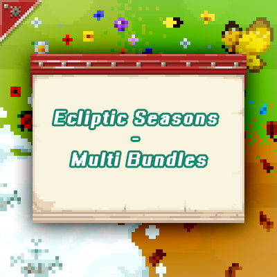

# Ecliptic Seasons: Bundles

A collection of DataPacks and resource packs providing cross-mod compatibility
for [Ecliptic Seasons](https://www.curseforge.com/minecraft/mc-mods/ecliptic-seasons).

### Summary

Provides cross-version DataPack and resource pack support for Ecliptic Seasons and other mods, adjusting crops and
seasonal landscapes.

### Included Packs

| Pack Name                      | Description                                                              |
|--------------------------------|--------------------------------------------------------------------------|
| **Biomes O' Plenty**           | Adjusts crops and plants; adds humidity rules and snow-covered variants. |
| **Let's Do Series**            | Adds seasonal rules for crops, animals, and landscapes.                  |
| **Nature's Spirit**            | Seasonal and humidity rules; snow-covered plant variants.                |
| **No Man's Land**              | Seasonal rules for crops and animals; autumn biome adjustments.          |
| **Oh The Biomes We've Gone**   | Removes seasonal limits; adds humidity rules and snow-covered plants.    |
| **Regions Unexplored**         | Seasonal and humidity rules; snow-covered plants in themed biomes.       |
| **DataPack - Abnormal**        | Seasonal and humidity support for abnormal crops.                        |
| **DataPack - Bountiful Fares** | Seasonal and humidity support for Bountiful Fares crops.                 |
| **DataPack - Concoction**      | Seasonal and humidity support for Concoction crops.                      |
| **DataPack - Customized**      | Seasonal and humidity support for customized crops.                      |
| **DataPack - Forestry**        | Seasonal and humidity support for forestry crops.                        |
| **DataPack - Vital Herbs**     | Seasonal and humidity support for vital herbs.                           |

*More packs will be added over time.*

### Other Information

GitHub: [https://github.com/TeamTeaMC/Ecliptic-Seasons-Bundles](https://github.com/TeamTeaMC/Ecliptic-Seasons-Bundles)  
Discord: [@RCxe9qt4ka](https://discord.com/invite/RCxe9qt4ka)

